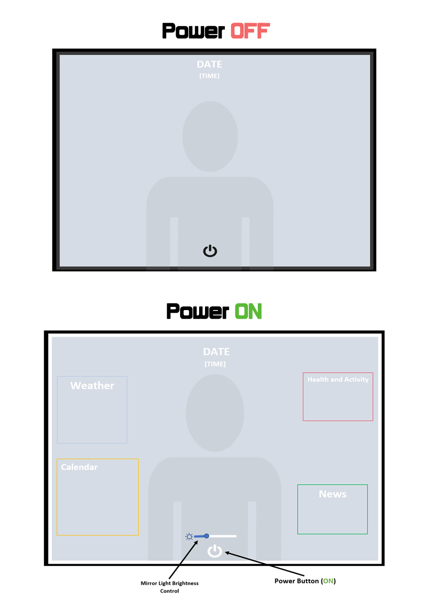

# p2.Ejiroghene.Greg-Amaihwe
Project2-CS3366(Human Computer Interaction) - Fall 2022

Project Description:

- People now have access to a rapidly growing number of public data sources from the web/cloud which are getting augmented with personal sensors which now commonly talk to mobile phones or web pages. We are going to look at designing an interface to make this kind of data and more available on your personal bathroom mirror (single person use), which could act as a large display touch display.

- The project couldd be implemented in Processing or p5.js; other supporting libraries can be used.

# Links

__Presentation page:__ 

__Github repository:__ https://github.com/EGreg-Amaihwe/egreg-amaihwe.github.io

__Processing Demo of Proposed Design:__ 

#

***GETTING C:***

To get a C , you need to:

__Sketch of interface__

              

https://github.com/EGreg-Amaihwe/egreg-amaihwe.github.io/blob/main/p2.ejiroghene.greg-amaihwe.png 

Discussions of your design and your sketch for the C

__Sketch design__   

The proposed design for this smart mirror consists of an interactive glass material. When turned on, Time and Date displays stay on and Current Weather, Calender, Health, News and Calender/Schedule section shows events for the current day as well some early events for the rest of the week. A Health/Activity shows Sleep time of previous night, Current Weight, Workout time and Mirror Time. Design also has inner LED borders that will light up based on brightness control values from Brightness slider that is displayed when on.

#

***GETTING B:***

Explainations of your implementation and how your mirror works B

__Implementation and How Mirror works__

Program/Mirror starts of in its off state where only time and Power button is displayed, when power button is clicked, the on state is triggered causing all sections/panels to be displayed. 

- Date and Time: Current and constantly updated Date containing Day of the week, (numbered) Day, Month then year is displayed above Current time (Hour, Minute and AM or PM denomination) 

- Weather: The weather panel uses API to get current weather information. It displays current Location Abbreviation next to current weather in fahrenheit and associated Icon. Under this are Weather displays showing the highest and lowest temperatures for the next 5 days with their corresponding weather icons. Icons are grabbed updated from weather webstie/API and based given Weather condition i.e. sunny is a sun icon, cloudy is a clouds with no sun, rain is water droplets etc.

- News: The news panel also uses API to grab, update and news source name, title of article that is being focused on and cover image. To avoid Visual clutter and interference with other panel text, only the News source name and Article cover image is displayed at first. To see Headline, user must hover over or touch the area containing New source name and cover image.

- Health/Activity: All elements of Health/Activity panel are hardcoded to display relevant Health Statistics. When mirror is turned on, A timer is started to calculate time spent infront of mirror to notify user of unhealthy interaction habits with Smart mirror that may lead to time wasting or/and lateness to events.

#

***GETTING A:***

Explainations of the advanced features and embed your 2-minute presenation video 

__Advanced features__

1. User Customization: Users are able to drag and drop all panels except news panel due to Article title summary text that is displayed when News area is hovered over or touched.   
2. Lighting: The Smart Mirror includes a Light up Border that can be controled by Brightness control slider at the bottom and middle of mirror. 

SKETCH

__DEMO LINK:__ https://youtu.be/QvCTUp_AuhM

